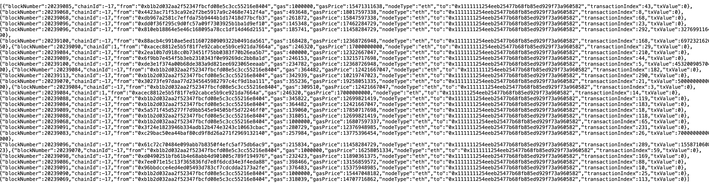
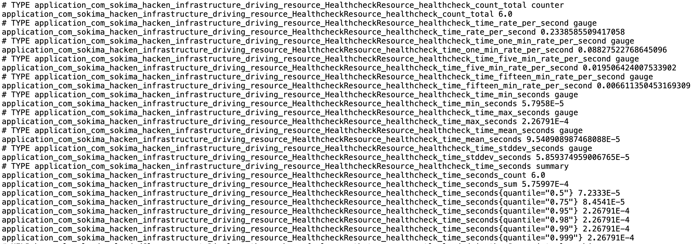
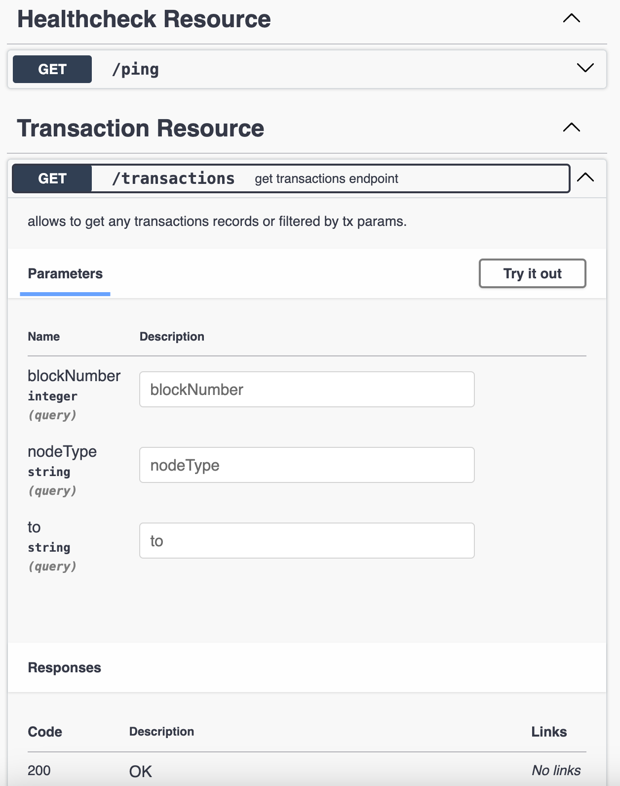

# hacken

## Database
Uses postgres to start:
```
docker run --name tx-postgres -d --rm \
  -e POSTGRES_USER=postgres \
  -e POSTGRES_PASSWORD=postgres \
  -e POSTGRES_DB=tx \
  -p 5432:5432 \
  postgres:14.1
```

Execute init script:
```sql
create table TransactionEntity
(
    id               bigint not null,
    blockNumber      numeric(38, 0),
    chainId          bigint,
    txFrom           varchar(255),
    gas              numeric(38, 0),
    gasPrice         numeric(38, 0),
    nodeType         varchar(255),
    txTo             varchar(255),
    transactionIndex numeric(38, 0),
    txValue          numeric(38, 0),
    primary key (id)
);
create sequence TransactionEntity_SEQ start with 1 increment by 50;
```

## REST API

GET /transactions (get first 500 records)

GET /transactions?to=<VALUE> (get txs by `to`)

GET /transactions?nodeType=<VALUE> (get txs by `nodeType`, e.g. eth)

GET /transactions?blockNumber=<VALUE> (get txs by `blockNumber`)

### Api Doc
Refer to `/swagger-ui`

### Metrics
Refer to `/q/metrics`

## Demonstration 
Pulling tx from eth-mainnet:


Db screenshot with saved tx:


REST GET /transactions query:


Metrics example:


Swagger example:

